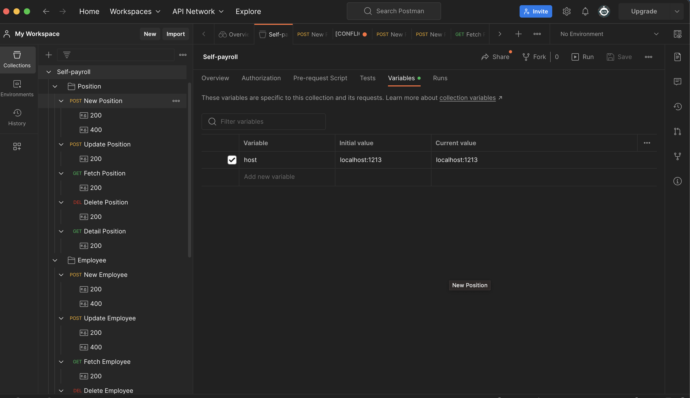
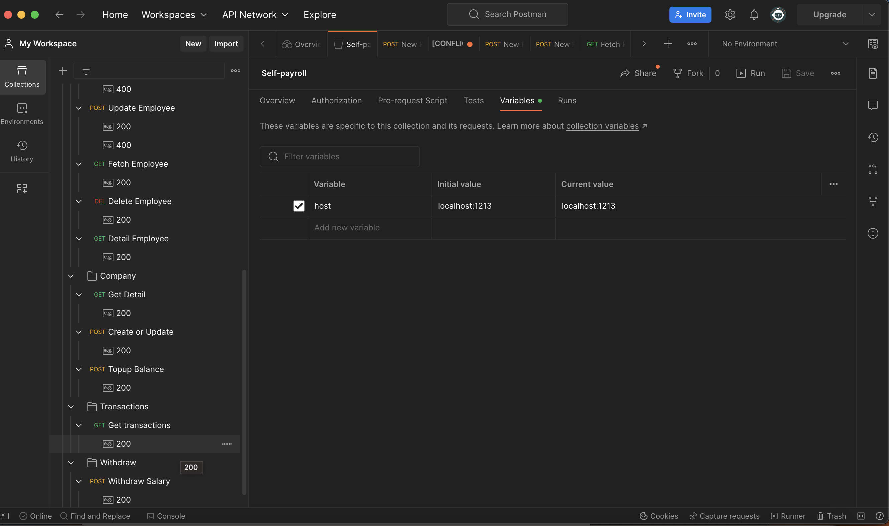
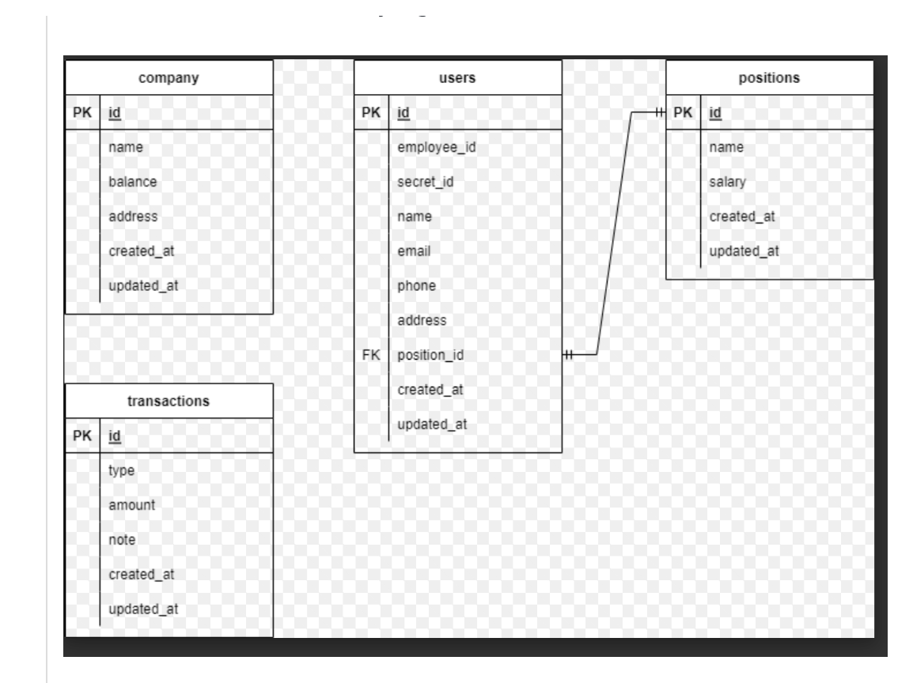

# Rakamin VIX - Core Initiative Backend Virtual Internship Program

Welcome to my solution for the final assignment of the Core Initiative Backend Virtual Internship Program! This is my second attempt at taking Rakamin Virtual Experience (VIX), having the role of Golang Backend Engineer intern. This repository is the result of my efforts to complete the final assignment, which aims to evaluate my understanding and implementation of CRUD operations, routing, clean architecture, and database management.

## What's in this Repository?

This repository contains my solution to the final assignment of the [Rakamin VIX - Core Initiative Backend Virtual Internship Program](https://www.rakamin.com/virtual-internship-experience/backend-development-core-insiative).
Here are some of the libraries and frameworks that I used to build the app:
- API: [Echo](https://echo.labstack.com/)
- ORM: [GORM](https://gorm.io/)
- Logger: [Echo Middleware](https://echo.labstack.com/middleware/logger/)
- DB: [PostgreSQL](https://gorm.io/docs/connecting_to_the_database.html#PostgreSQL)

### The Task at Hand

The final assignment required me to complete the following tasks:
1. Having a routing table complying with this [Postman collection](Self-payroll.postman_collection.json).
2. Implementing CRUD operations (create, read, update, delete) to the User data.
3. Implementing CRUD operations (create, read, update, delete) to the Position data.
3. Able to top up the balance of the company.
4. Able to withdraw a user's salary by providing the ID and the secret ID of the user, the salary number will be based on the job position of the user.
5. There is log data of top-up and withdrawal events.
6. Implementing clean architecture.

### Additional Resources

Here are some additional resources to help you understand more about the app contained in this repository:

- The below images are the sample appearances showing the routing table when importing the Postman collection.
  

  

  

- The below image is the database design made by the assignor.
  

### Conclusion
In conclusion, my second attempt at the Rakamin VIX as a backend engineer provided me with new insights and sharpened my knowledge about backend development. Even though the assignment was easier and less complex than the previous one, it still covered the fundamental things of backend development. It also taught me the importance of adapting to the company's way/format of achieving goals. I believe this program is another excellent resource for anyone interested in backend development, particularly in Golang.
 